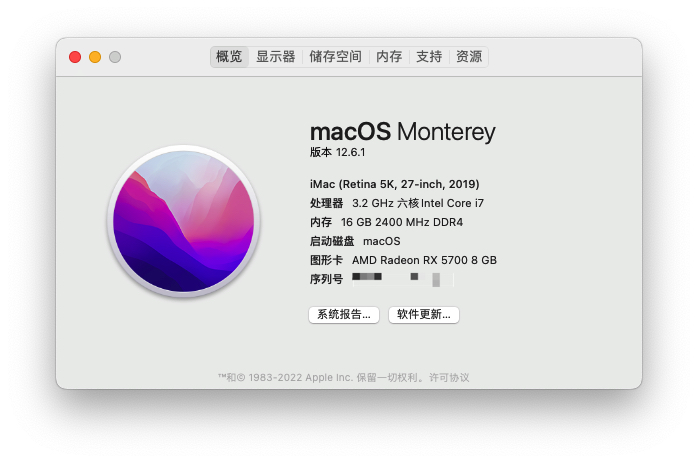
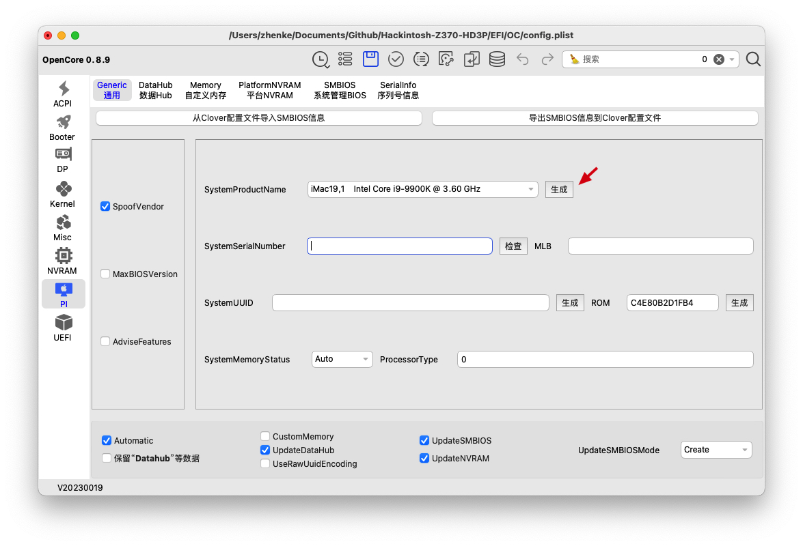

# Hackintosh

A Hackintosh running macOS Monterey 12.6.1 with a i7-8700 and a Gigabyte Z370-HD3P.

## Hardware

| Hardware    	| Detail                       	|
|-------------	|------------------------------	|
| CPU         	| Core i7 - 8700K              	|
| Motherboard 	| Gigabyte Z370 HD3P           	|
| RAM         	| 2x8GB Kingston 2400Mhz          	|
| VGA         	| Radeon RX 5700XL
| Storage     	| Samsung 860 EVO 250GB - SATA 	|
| WiFi Card   	| Broadcom BCM43602CS

## 重要说明

请使用 [OCAuxiliaryTools](https://github.com/ic005k/OCAuxiliaryTools) 工具生成一个新的Mac序列号。

